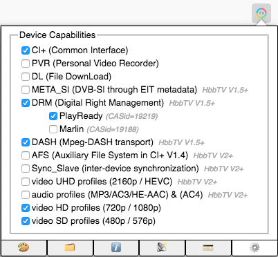

<p align="center">

</p>
<p align="center">
  &nbsp;&nbsp;&nbsp;
	<a href="https://travis-ci.org/karl-rousseau/HybridTvViewer" alt="Travis-CI"></a>&nbsp;&nbsp;&nbsp;
  &nbsp;&nbsp;&nbsp;
	<a href="https://github.com/karl-rousseau/HybridTvViewer/blob/master/LICENSE" alt="License:MIT"></a><br>
  <br>
</p>
A browser extension following such Hybrid interactive TV technologies:

 &nbsp;&nbsp;&nbsp;  &nbsp;&nbsp;&nbsp; 


## Preamble

```
Be aware that if this browser extension version is still less than 1.0, do consider it as a prototype!
```
The purpose of this project is to avoid the default browser action which is to download various iTV (interactive television) application pages based on the HTML standard with some proprietary methods. Here this browser extension is detecting those pages and injecting during page load an emulation layer (plus a bottom UI toolbar). In addition, unrecognized video formats are also handled by external HTML5 video plugins.

## Installation

This browser extension is available for free on those distribution platforms:

| Browser: | Mozilla Firefox (not ESR) | Google Chrome / Microsoft Edge |
| -------- | ----------------------------- | ---------------------- |
| Version: | V67+ for ES6 dynamic import | V63+ for ES6 dynamic import |
| Extension availability: | [](https://addons.mozilla.org/en-US/firefox/addon/hybridtvviewer/) | ☑️ unpublished (will try M$ Store)<br>➳ instead see [wiki](https://github.com/karl-rousseau/HybridTvViewer/wiki/HowTo) dev install |

## Restrictions

Please note that not all video codecs are recognized in current (i.e. 2020) browsers:

| Browser: | Mozilla Firefox | Google Chrome | Apple Safari | Android Chrome |
| -------- | -------- | ------ | ------ | ------ |
| Codec [H.264](https://caniuse.com/#feat=mpeg4): | ✅ embedded plugin by Cisco | ✅ present | ✅ present | ✅ present |
| Codec [H.265](https://caniuse.com/#feat=hevc): | ❌ no free license | ✅ [here](https://github.com/henrypp/chromium/releases) (win10) | ✅ in MacOS 10.13+ | ☑️ device-dependent |

If you need to create your own video stream (within TS or DASH container), I suggest you the well-known [FFMPEG](https://www.ffmpeg.org/) or [MP4BOX](https://gpac.wp.imt.fr/mp4box/) tools. And in real life (i.e. without this extension), OpenCaster will help you to create your own TS file that can be broadcasted with a [Dektec](https://www.dektec.com/products/USB/DTU-315/) or [Hides](http://www.hides.com.tw/product_opencaster_eng.html) USB modulator and you will then be able to test your app on a true Oipf/Hbbtv device (like a Smart TV)

➳ see [Tools](#Tools)

## Screenshots

 &nbsp; 

## Features

| Feature            | Description |
| ------------------ | ----------- |
| auto-detection     | an analysis of HTTP server headers and embedded HTML header & meta tags, is performed |
| forced detection   | user on-clicked power button  will force or disable iTV emulation (auto-saved in web extension local storage) |
| bottom bar  | located underneath the screen rendering, the emulator is providing some buttons (colored keys, resolutions for zoomed rendering, ...) |
| iDTV customization | the extension enables customization of various parameters (user-agent, OIPF capabilities, country, CAS id, DVB channels, ...) |
| external inputs | it handles some external inputs such as CI+ APDU reply message, Stream-Event content customization & triggering, DVB channels with customized LCN, ... |
| video support | it handles the rendering of browser unrecognized broadcast video stream: Mpeg-TS and Mpeg-DASH (with the help of external libraries) |

## Usage

You can use the arrow keys <kbd>&leftarrow;</kbd>,<kbd>&rightarrow;</kbd>,<kbd>&uparrow;</kbd>,<kbd>&downarrow;</kbd>, <kbd>enter</kbd> and <kbd>backspace</kbd> keys to navigate inside the emulated iTV application.  
Colored keys are also mapped to <kbd>R</kbd>, <kbd>G</kbd>, <kbd>B</kbd> and <kbd>Y</kbd> keyboard keys.

For more info, have a look at the [Wiki](https://github.com/karl-rousseau/HybridTvViewer/wiki/HowTo) page.

## Examples

The purpose of this extension is mainly to validate the **MIT-xperts test suite** under CHROME and FIREFOX.  
Here are some example URLs that have been extracted from various sources:

| Name          | Source | URL |
| ------------- | ------ |---- |
| MIT-xperts HbbTV test suite | DTT & DVB-S [TS stream](https://github.com/mitxp/HbbTV-Testsuite/wiki) | http://itv.mit-xperts.com/hbbtvtest/ |
| ARTE HbbTV    | French DTT TS | http://www.arte.tv/hbbtvv2/index.html |
| ARTE CE-HTML  | Philips iDTV portal | http://cehtml.arte.tv/de/2764896.cehtml |
| ...           | Catalog (with dead ones) | http://urju.de/hbbtv/ |

If you want to create your own [HbbTV](https://www.hbbtv.org) application, you can start with such code:
```html
<!DOCTYPE html PUBLIC "-//HbbTV//1.1.1//EN" "http://www.hbbtv.org/dtd/HbbTV-1.1.1.dtd">
<html xmlns="http://www.w3.org/1999/xhtml"><head>
<title>My 1st HbbTV app</title>
<meta http-equiv="Content-Type" content="application/vnd.hbbtv.xhtml+xml; charset=UTF-8" />
<meta http-equiv="pragma" content="no-cache" />
<style>* { margin:0; padding:0; background-repeat:no-repeat; font-family:Tiresias,sans-serif; }
#broadcast { position:absolute; top:0; left:0; width:1280px; height:720px; }
#title { position:absolute; top:200px; left:200px; width:100px; height:99px; font-size:32px; color:red; }</style>
<script type="text/javascript">
//<![CDATA[
window.onload = function() {
  var app = document.getElementById('oipfAppMan');
  if (app && app.getOwnerApplication) app = app.getOwnerApplication(document);
  if (app && app.show) app.show(); // needed to show the HbbTV app on screen
  if (app && app.activate) app.activate();
  if (app && app.privateData) app.privateData.keyset.setValue(0x1f);
  window.focus();
  window.onkeydown = function(event) {
	  switch(event.keyCode) {
		  case 13: case window.VK_ENTER:
			  document.getElementById('title').textContent = 'OK key pressed';
			  event.stopPropagation(); event.preventDefault(); return false; break;
		  default: return true;
	  }
  };
  // Here is you app code ...
  document.getElementById('title').textContent = 'Hello from HbbTV';
};
//]]>
</script>
</head><body>
<object id="broadcast" type="video/broadcast"></object>
<object id="oipfAppMan" type="application/oipfApplicationManager" style="width:0; height:0;"></object>
<object id="oipfConfig" type="application/oipfConfiguration" style="width:0; height:0;"></object>
<div id="title"></div>
</body></html>
```
> Please note that there are more information on the [Wiki page](https://github.com/karl-rousseau/HybridTvViewer/wiki/HowTo).  
You can also check your page validity content on this [HbbTV validator](http://hbbtv-live.irt.de/validator/).  
I also recommend you the [BBC Tal framework](http://www.bbc.co.uk/opensource/projects/TAL) which handles HbbTV devices through configuration files.

## Dependencies

This project is not modifying those libraries and only doing a dynamic dependency call at runtime on their CDN releases.
- [DASH.js](https://github.com/Dash-Industry-Forum/dash.js): reference client to decode DASH manifest files and provide DASH segments to HTML5 MSE+EME video player  
  ↳ Copyright 2015 Dash Industry Forum with BSD license
- [MUX.js](https://github.com/videojs/mux.js): useful library to transmux Mpeg-TS to MP4 on the fly in order to feed HTML5 MSE video player  
  ↳ Copyright 2015 Brightcove with APACHE 2.0 license

## Abbreviations

- iTV: Interactive TeleVision
- iDTV: Integrated Digital TeleVision
- CI+: Common Interface
- HLS: HTTP Live Streaming
- DASH: Dynamic Adaptive Streaming over HTTP
- DVB: Digital Video Broadcasting
- DVB-T: Digital Video Broadcasting Terrestrial
- DVB-C: Digital Video Broadcasting Cable
- DVB-S: Digital Video Broadcasting Satellite
- DVB-SI: DVB Service Information
- AIT: Application Information Table
- EIT: Event Information Table (can be **P**resent / **F**ollowing / **Sch**edule events)
- LCN: Logical Channel Number (using 3 or 4 digits)

## References

- MHP (Multimedia Home Platform) : Based on SUN JAVA technology working on [GEM-MHP](https://en.wikipedia.org/wiki/Globally_Executable_MHP) middleware
  * initialy defined by [ETSI TS 101 812](http://www.etsi.org/deliver/etsi_ts/101800_101899/101812/01.02.01_60/ts_101812v010201p.pdf) documentation
  * no more ~~supported in browsers~~ (might still run on Firefox 52 ESR + Java8 NPAPI plugin + BDJ.jar + viewer)
- HbbTV (Hybrid Broadband Broadcast TeleVision) :
  * defined by current [ETSI TS 102 796 V1.3.1](http://www.etsi.org/deliver/etsi_ts/102700_102799/102796/01.03.01_60/ts_102796v010301p.pdf) specifications (aka HbbTV V2.0)
    * bringing *Companion Screen* management and *HTML5 video tag* notation within [HbbTV V2.0 only](https://www.hbbtv.org/resource-library/#specifications)
  * following old MHP AITX structure
  * handling some CEA-2014 notations ~ EcmaScript 3.0 and ~~not ES6~~ ⚠️ (use a compiler such as [Babel](https://babeljs.io/))
  * implementing a subset of [OIPF objects](https://www.oipf.tv/) (with optional ones: +PVR +DL ...)
  * replacing device manufacturer's portal using [OpApps TS 103 606](https://www.hbbtv.org/resource-library/specifications/#spec-operator-applications-opapps) features
- OHTV (Open Hybrid TV) : similar to HbbTV and used for example at [iCON TV](http://able.kbs.co.kr/enter/tal_view.php?mseq=16&pcg=&pgseq=&no=270211) in KOREA by the national broadcaster *KBS* since 2010. Since 2016, it is now named IBB (Integrated Broadcast Broadband) defined by [ITU-R BT.2267-6](https://www.itu.int/dms_pub/itu-r/opb/rep/R-REP-BT.2267-6-2016-PDF-E.pdf)
- BML (Broadcast Markup Language) : similar to HbbTV and defined by ARIB STD B-24 standard used in JAPAN over ISDB-T broadcasted channels like [*NHK*](https://www.nhk.or.jp/strl/publica/bt/en/fe0003-1.html)
- CE-HTML (Consumer Electronics HTML) : nowadays less used and only found on old devices.
- OIPF (Open IPTV Forum) : used on some STB. Since 2014 activities have been transferred to HbbTV association
- ATSC (Advanced Television Systems Committee) : broadcast standard in USA where [ATSC V3](https://www.atsc.org/standards/atsc-3-0-standards/) follows HbbTV V2

## Tools and hardware

- [VizionR](http://vizionr.com/) is a French 🇫🇷 company selling various softwares like [Unyssea HbbTV injector](http://vizionr.com/Booklet_InserterHbbTV_en.pdf) and also a modulator named [BeeBeeBox](http://site.vizionr.fr/site/index.php/offre-hbbtv/) compliant HbbTV with DSMCC support
- [Mit-Xperts](https://www.mit-xperts.com/products/) is a German 🇩🇪 company selling various softwares like [iMux multiplexer server](https://www.mit-xperts.com/products/imux/imux.pdf) having HbbTV/MHP/MHEG with carousels support
- [Avalpa OpenCaster](https://github.com/aventuri/opencaster) is a free Italian 🇮🇹 software needed if you want to broadcast your application using a modulator (such as next Hides Inc one), you can package your TS file (including object carousel) and broadcast it using this free software (over your local network or through a modulator)
- [Hides Inc](http://www.hides.com.tw/product_eng.html) is a Taiwan 🇹🇼 company selling an USB DVB-T modulator named [UT-100C](http://www.hides.com.tw/product_opencaster_eng.html) which includes [OpenCaster software](http://www.avalpa.com/the-key-values/15-free-software/33-opencaster) and [windows & linux drivers](https://www.dropbox.com/sh/r80tjnkapkgzeg9/AAC_CaOmlOKQeh7h90wbkUfpa)
- [Dektec](https://www.dektec.com/products/) is a US 🇺🇸 company offering a catalog of various modulators on PCIe, USB2 and also USB3, here called [DTU-315](https://www.dektec.com/products/USB/DTU-315/) using the broadcasting command [DtPlay](https://www.dektec.com/downloads/utilities/) on Linux and [StreamXpress](https://www.dektec.com/products/applications/StreamXpress/) under Windows™️

## Personal Wishes

I really hope that next HbbTV 3.0 release will have such features:
- a well defined ES5 foundation following HTML5 browsers with also the addition of **Canvas & WebGL** (every device has now an internal GPU to support hardware acceleration)
- a [complete implementation](http://www.dial-multiscreen.org/dial-protocol-specification) of **DIAL protocol** which provides a list of available registered remote apps (merged from local broadcasting servers during the discovery scan) that we can display as a grid of apps (as an app store like on AndroidTV), for example in an OpApp portal.
- like Samsung SDK with *NaCl* (migrating to WASM soon), it will be great to have HbbTV with **WebAssembly** (also including Thread support which will help to use multi-core SoC for AI computation. Nowadays most SmartTV do have a 4-cores ARM CPU)

## Show your support

&nbsp;Please don't forget to add a ⭐️ to this repository if this project helped you!
